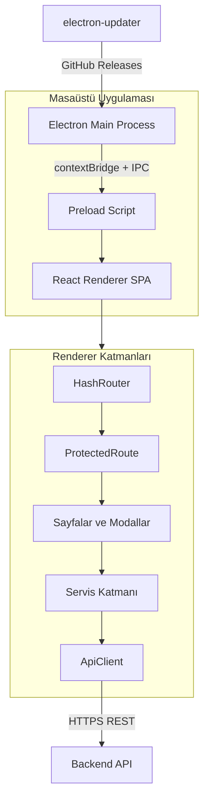

# İskeleTakip Desktop — Teknik Özellikler

Bu doküman, **İskeleTakip Desktop** (Electron) projesinin yazılımsal yapısını, mimarisini ve kullanılan teknolojileri tek bir referansta toplar.

**Sürüm:** 1.6.10  
**Son güncelleme:** Temmuz 2026

---

## 1. Proje Özeti

İskeleTakip Desktop, iskele kiralama ve satış operasyonlarını yönetmek için geliştirilmiş bir **masaüstü istemci uygulamasıdır**. Müşteri, sözleşme, teklif, envanter, depo, stok fişi, çek, nakit hesap, raporlama ve sistem yönetimi süreçlerini tek arayüzden yönetir.

Uygulama **Electron** kabuğu içinde çalışan bir **React SPA** (Single Page Application) olarak tasarlanmıştır. Tüm iş verisi harici bir **REST API backend** üzerinden alınır; istemci tarafında kalıcı veritabanı bulunmaz.

| Özellik | Değer |
|---------|-------|
| Uygulama kimliği | `com.iskeletakip.app` |
| Ürün adı | IskeleTakip |
| Hedef platform | Windows (x64, NSIS installer) |
| Dağıtım | GitHub Releases (`electron-updater`) |
| Backend iletişimi | REST API + JWT Bearer token |

---

## 2. Yüksek Seviye Mimari

Uygulama üç ana katmandan oluşur: **Electron ana süreç**, **preload köprüsü** ve **React renderer**. İş mantığı ve kullanıcı arayüzü tamamen renderer tarafındadır; Electron ana süreç pencere yönetimi, güvenlik politikası ve otomatik güncelleme gibi sistem görevlerini üstlenir.



### 2.1 Mimari Prensipler

- **API-First:** Tüm CRUD ve iş mantığı backend'de; istemci yalnızca sunum ve API çağrıları yapar.
- **İnce global state:** Zustand yalnızca oturum, tema, toast ve güncelleme durumu için kullanılır; sayfa verisi servis + lokal component state ile yönetilir.
- **Domain odaklı organizasyon:** Her iş alanı (müşteri, sözleşme, depo vb.) kendi sayfası, modal seti ve servisi ile ayrılır.
- **Güvenli Electron yapılandırması:** `nodeIntegration: false`, `contextIsolation: true`; renderer doğrudan Node.js API'lerine erişemez.
- **Hash tabanlı routing:** Paketlenmiş Electron dağıtımında dosya sistemi tabanlı URL sorunlarını önlemek için `HashRouter` kullanılır.

---

## 3. Katman Detayları

### 3.1 Electron Ana Süreç (`electron/main.ts`)

Ana süreç uygulamanın sistem seviyesi giriş noktasıdır.

**Sorumluluklar:**

| Alan | Açıklama |
|------|----------|
| Pencere yönetimi | 1200×800 varsayılan boyut, minimum 1000×600 |
| Ortam ayrımı | Dev: `http://localhost:5175` + DevTools; Prod: `dist-web/index.html` |
| Güvenlik | CSP (Content Security Policy) başlıkları dev/prod için ayrı tanımlı |
| Oturum temizliği | Pencere kapanırken `localStorage` token temizliği |
| Otomatik güncelleme | `electron-updater` ile GitHub Releases kontrolü |
| IPC işleyicileri | Güncelleme indirme/yükleme, sürüm sorgulama |
| Windows AppID | Bildirimler ve updater için `com.iskeletakip.app` |

**Otomatik güncelleme akışı:**

1. Uygulama paketlenmiş modda açıldığında güncelleme kontrolü başlar.
2. Yeni sürüm bulunursa renderer'a IPC ile bildirilir.
3. Kullanıcı onayı ile indirme başlar (`autoDownload: false`).
4. İndirme tamamlanınca `quitAndInstall` ile yeniden başlatılır.

**Kullanılan paketler:** `electron-updater`, `electron-log`

### 3.2 Preload Köprüsü (`electron/preload.ts`)

Preload script, `contextBridge.exposeInMainWorld` ile renderer'a sınırlı bir API yüzeyi sunar. Bu yaklaşım IPC saldırı alanını minimize eder.

Renderer'a açılan API:

```typescript
window.electron = {
  platform: string,           // 'win32' | 'darwin' | 'linux'
  appVersion: string,         // Uygulama sürümü
  updates: {
    onUpdateChecking(callback),
    onUpdateAvailable(callback),
    onUpdateNotAvailable(callback),
    onUpdateError(callback),
    onUpdateDownloadProgress(callback),
    onUpdateDownloaded(callback),
    startDownload(),
    installUpdate(),
    checkForUpdates(),
  }
}
```

### 3.3 React Renderer (`src/`)

Uygulamanın tamamına yakın kısmı bu katmandadır.

**Başlangıç akışı:**

1. `src/main.tsx` — polyfill'ler (`URL.parse`, `Promise.try`), tema uygulama, React mount
2. `src/App.tsx` — routing, global sağlayıcılar (`ContextMenuProvider`, `UpdateListener`, `ToastContainer`)
3. `ProtectedRoute` — oturum, admin ve izin kontrolü
4. `MainLayout` — sidebar + header + içerik alanı
5. İlgili sayfa bileşeni render edilir

---

## 4. Yazılımsal Yapı ve Klasör Organizasyonu

```
IskeleTakipElectron/
├── electron/                  # Electron ana süreç ve preload
│   ├── main.ts                # Ana süreç giriş noktası
│   └── preload.ts             # Güvenli IPC köprüsü
├── src/                       # React uygulaması
│   ├── main.tsx               # Renderer giriş noktası
│   ├── App.tsx                # Route tanımları
│   ├── pages/                 # Sayfa bileşenleri (21 sayfa)
│   ├── components/            # Yeniden kullanılabilir UI bileşenleri
│   │   └── modals/            # Detay/düzenleme modal pencereleri
│   ├── layouts/               # Ana layout ve header context
│   ├── services/              # Backend API servisleri (27 servis)
│   ├── store/                 # Zustand global store'ları
│   ├── models/                # TypeScript tip tanımları (merkezi sözleşme)
│   ├── hooks/                 # Custom React hook'ları
│   ├── utils/                 # Yardımcı fonksiyonlar
│   ├── constants/             # Sabitler (Excel import vb.)
│   ├── context-menu/          # Sağ tık menü altyapısı
│   └── styles/                # Global CSS + Tailwind
├── public/                    # Statik dosyalar (PDF worker, ikonlar)
├── assets/                    # Uygulama ikonları ve logolar
├── scripts/                   # Yayınlama scriptleri
├── dist-web/                  # Vite build çıktısı (renderer)
├── dist-electron/             # TypeScript derleme çıktısı (main/preload)
├── release/                   # electron-builder installer çıktısı
├── vite.config.ts             # Vite yapılandırması
├── electron-builder.config.js # Paketleme yapılandırması
├── tailwind.config.js         # Tailwind tema ve bileşen sınıfları
└── package.json               # Bağımlılıklar ve npm scriptleri
```

### 4.1 Sayfa Modülleri (`src/pages/`)

| Modül | Route | Açıklama |
|-------|-------|----------|
| Dashboard | `/` | Özet panel ve grafikler |
| Müşteriler | `/customers` | Müşteri CRUD, arşivleme |
| Envanter | `/inventory` | Malzeme/stok yönetimi |
| Stok hareketleri | `/inventory/:itemId/movements` | Kalem bazlı hareket geçmişi |
| Depolar | `/warehouses`, `/warehouses/:id` | Depo listesi ve detay |
| Sözleşmeler (kiralama) | `/contracts/rental` | Kiralama sözleşmeleri |
| Sözleşmeler (satış) | `/contracts/sale` | Satış sözleşmeleri |
| Alış faturaları | `/purchase-invoices` | Tedarikçi faturaları |
| Stok fişleri | `/stock-receipts` | Giriş/çıkış fişleri |
| Çekler | `/checks` | Çek takibi (izin: `checks_view`) |
| Nakit | `/cash`, `/cash/accounts/:accountId` | Kasa hesapları (izin: `cash_view`) |
| Fiyat tarifeleri | `/price-tiers` | Kiralama fiyat katmanları |
| Fiyatlandırma kuralları | `/pricing-rules` | Otomatik fiyat kuralları |
| Teklif yönetimi | `/offer-management` | Teklif paketleri ve şablonlar |
| Kiralama hareket raporu | `/reports/rental-movement` | Raporlama |
| Kullanıcılar | `/users` | Kullanıcı yönetimi |
| Denetim günlükleri | `/audit-logs` | Audit log timeline |
| Sistem ayarları | `/system-settings` | Admin-only ayarlar |

### 4.2 Servis Katmanı (`src/services/`)

Tüm HTTP istekleri `apiClient.ts` üzerinden geçer; domain servisleri bu istemciyi sarmalar.

| Grup | Servisler |
|------|-----------|
| Kimlik ve yönetim | `authService`, `userService`, `permissionService`, `adminService`, `auditLogService` |
| CRM / operasyon | `customerService`, `siteService`, `inventoryService`, `warehouseService`, `subcategoryService`, `unitService` |
| Ticari süreç | `contractService`, `quoteService`, `priceTierService`, `pricingRulesService`, `packageService`, `stockReceiptService` |
| Finans | `checkService`, `cashService`, `purchaseInvoiceService` |
| Şablon ve rapor | `contractTemplateService`, `quoteTemplateService`, `reportTemplateService`, `reportService`, `templateImageService` |

### 4.3 Model Katmanı (`src/models/index.ts`)

Merkezi TypeScript tip sözleşmesi; backend DTO'ları ile uyumlu arayüzler içerir:

- **CRM:** `Customer`, `ConstructionSite`, `AuthorizedContact`
- **Envanter:** `Inventory`, `MaterialCategory`, `SubCategory`, `Unit`
- **Depo:** `Warehouse`, `WarehouseMovement`
- **Sözleşme/Teklif:** `Contract`, `ContractLine`, `Quote`, `QuoteLine`, `QuotePackage`
- **Finans:** `Check`, `CashAccount`, `CashTransaction`, `PurchaseInvoice`
- **Fiyatlandırma:** `PriceTier`, `PricingRule`, `CategoryDiscount`
- **Şablon/Rapor:** `ContractTemplate`, `QuoteTemplate`, `ReportTemplate`
- **Yönetim:** `User`, `Permission`, `AuditLog`, `SystemSetting`

### 4.4 Global State (`src/store/`)

| Store | Amaç |
|-------|------|
| `authStore` | JWT token, kullanıcı bilgisi, oturum durumu (`localStorage` persist) |
| `themeStore` | Açık/koyu tema (`data-theme` attribute, `localStorage` persist) |
| `updateStore` | Otomatik güncelleme durumu (indirme ilerlemesi, hata) |

Toast bildirimleri `useToast` hook'u ile yönetilir (ayrı Zustand store).

---

## 5. Mimari Desenler

### 5.1 Sayfa + Modal Deseni

Liste ve özet bilgiler sayfa bileşenlerinde; detay, düzenleme ve onay işlemleri modal pencerelerde yapılır. Örnek:

- `CustomersPage` → `CustomerDetailModal`
- `ContractsPage` → `ContractDetailModal`, `QuoteDetailModal`
- `InventoryPage` → `InventoryDetailModal`, `CategoryDiscountModal`

Bu desen, tek sayfa uygulamasında derin navigasyon ihtiyacını azaltır ve kullanıcı bağlamını korur.

### 5.2 Route Guard (Erişim Kontrolü)

`ProtectedRoute` üç seviyede kontrol yapar:

1. **Oturum:** `isAuthenticated === false` → `/login` yönlendirmesi
2. **Admin:** `adminOnly` prop → `isAdminUser()` kontrolü
3. **İzin:** `requiredPermission` prop → `user.permissions` içinde arama

Sidebar menüsü de aynı izin mantığıyla filtrelenir.

### 5.3 Merkezi API İstemcisi

`ApiClient` sınıfı tüm HTTP iletişimini standartlaştırır:

- `GET`, `POST`, `PATCH`, `DELETE`, `PUT` JSON istekleri
- `Authorization: Bearer <token>` otomatik ekleme
- Blob indirme (`getBlob`, `getBlobDownload`)
- Multipart form upload (`postFormData`)
- 204 boş yanıt ve hata normalizasyonu
- İstek metrikleri toplama (endpoint bazlı sayaç)
- Opsiyonel HMAC-SHA256 request signing

### 5.4 Hata Yönetimi

- API katmanı: HTTP status ve response body ayrıştırma
- `apiError.ts`: Backend hata mesajlarını Türkçe kullanıcı dostu metne dönüştürme
- Toast altyapısı: Başarı/hata/uyarı bildirimleri, tekrar engelleme, otomatik kapanma

---

## 6. Kullanılan Teknolojiler

### 6.1 Çekirdek Stack

| Teknoloji | Sürüm | Rol |
|-----------|-------|-----|
| **Electron** | ^28.0.0 | Masaüstü uygulama kabuğu |
| **React** | ^18.2.0 | UI framework (functional components + hooks) |
| **TypeScript** | ^5.3.3 | Tip güvenliği (strict mode) |
| **Vite** | ^5.0.8 | Build aracı ve dev sunucusu |

### 6.2 UI ve Stil

| Teknoloji | Sürüm | Rol |
|-----------|-------|-----|
| **Tailwind CSS** | ^3.4.0 | Utility-first CSS, koyu/açık tema |
| **PostCSS + Autoprefixer** | ^8.4 / ^10.4 | CSS işleme |
| **Phosphor Icons** | ^2.1.10 | İkon seti |
| **Recharts** | ^3.7.0 | Dashboard grafikleri |

### 6.3 Routing ve State

| Teknoloji | Sürüm | Rol |
|-----------|-------|-----|
| **React Router DOM** | ^6.21.1 | Hash tabanlı istemci routing |
| **Zustand** | ^4.4.7 | Hafif global state yönetimi |

### 6.4 Zengin İçerik ve Doküman

| Teknoloji | Sürüm | Rol |
|-----------|-------|-----|
| **Tiptap** | ^3.17.1 | Sözleşme/teklif şablon editörü (ProseMirror tabanlı) |
| **react-pdf + pdfjs-dist** | ^7.7 / ^3.11 | PDF önizleme |

Tiptap eklentileri: tablo, görsel, metin hizalama, alt çizgi, görsel yeniden boyutlandırma.

### 6.5 Electron Ekosistemi

| Teknoloji | Sürüm | Rol |
|-----------|-------|-----|
| **electron-builder** | ^24.9.1 | Windows NSIS installer üretimi |
| **electron-updater** | ^6.8.3 | GitHub Releases otomatik güncelleme |
| **electron-log** | ^5.4.4 | Ana süreç loglama |

### 6.6 Geliştirme Araçları

| Teknoloji | Sürüm | Rol |
|-----------|-------|-----|
| **Vitest** | ^4.1.5 | Birim testleri |
| **concurrently** | ^8.2.2 | Paralel dev script orkestrasyonu |
| **wait-on** | ^7.2.0 | Dev sunucu hazır olana kadar bekleme |
| **@vitejs/plugin-react** | ^4.2.1 | Vite React desteği (Fast Refresh) |

---

## 7. Güvenlik

### 7.1 Electron Güvenlik Yapılandırması

```typescript
webPreferences: {
  nodeIntegration: false,      // Node.js API erişimi kapalı
  contextIsolation: true,    // Preload izolasyonu aktif
  preload: 'preload.js',     // Sınırlı IPC köprüsü
}
```

### 7.2 Kimlik Doğrulama

- JWT Bearer token; `authStore` üzerinden `localStorage`'a persist edilir
- Her API isteğinde `Authorization` header otomatik eklenir
- Admin tespiti: `userId`, `username`, `role`, `roleId`, `roleName` fallback'leri

### 7.3 Request Signing (Opsiyonel)

`VITE_SIGNING_ENABLED=true` olduğunda:

- Her istek için `X-Timestamp`, `X-Nonce`, `X-Signature` header'ları eklenir
- İmza HMAC-SHA256 ile Web Crypto API üzerinden üretilir
- `/health` ve `/auth/login` imza dışı bırakılır

> **Not:** `VITE_*` değişkenleri frontend bundle'a gömülür. Client-side imzalama gerçek gizli anahtar güvenliği sağlamaz; kritik işlemler backend veya Electron main process tarafında doğrulanmalıdır.

### 7.4 Content Security Policy

Dev ve prod ortamları için ayrı CSP kuralları tanımlıdır. API sunucusu (`https://iskeletakip.mehmeterenozden.com`) connect-src ve img-src whitelist'ine eklenmiştir.

---

## 8. Build, Paketleme ve Dağıtım

### 8.1 NPM Scriptleri

| Komut | Açıklama |
|-------|----------|
| `npm run electron:dev` | Vite dev sunucusu + TS watch + Electron başlatma |
| `npm run build` | Yalnızca web (renderer) build |
| `npm run build:electron` | Main + preload + renderer production build |
| `npm run electron:build` | Installer üretimi (NSIS) |
| `npm run electron:pack` | Klasör çıktısı (installer olmadan) |
| `npm run test` | Vitest birim testleri |
| `npm run release:github` | GitHub Releases'e yükleme |
| `npm run release` | Sürüm artır + build + GitHub publish |

### 8.2 Build Çıktıları

| Klasör | İçerik |
|--------|--------|
| `dist-web/` | Vite renderer build (HTML, JS, CSS, asset'ler) |
| `dist-electron/` | Derlenmiş `main.js` ve `preload.js` |
| `release/` | NSIS installer (`IskeleTakip Setup x.x.x.exe`) |

### 8.3 Vite Yapılandırması

- Port: **5175** (strict)
- Output: `dist-web`
- Base path: `./` (Electron paketli dağıtıma uygun relatif yollar)
- Path alias: `@` → `./src`
- Tiptap bağımlılıkları `optimizeDeps.include` ile önceden optimize edilir

### 8.4 Dağıtım

- **Installer:** Windows NSIS, one-click, masaüstü + başlat menüsü kısayolu
- **Güncelleme:** `electron-updater` → GitHub Releases (`erenzdn/Iskele-Takip-Frontend`)
- **Yayınlama:** `scripts/publish-github.mjs` — `GH_TOKEN` veya `gh auth login` ile otomatik yükleme

---

## 9. Ortam Değişkenleri

| Değişken | Zorunlu | Açıklama |
|----------|---------|----------|
| `VITE_API_BASE_URL` | Hayır | Backend API adresi (varsayılan: `http://localhost:3000`) |
| `VITE_SIGNING_ENABLED` | Hayır | Request signing aktif/pasif (`true`/`false`) |
| `VITE_SIGNING_SECRET` | Signing aktifse evet | HMAC imza anahtarı (min. 32 karakter) |
| `GH_TOKEN` | Release için | GitHub Releases yükleme token'ı |
| `RELEASE_SKIP_TLS_VERIFY` | Hayır | Kurumsal ağ SSL sorunları için TLS doğrulama atlama |

---

## 10. TypeScript Yapılandırması

- **Hedef:** ES2020
- **Modül:** ESNext, `moduleResolution: bundler`
- **JSX:** `react-jsx` (React 17+ dönüşüm)
- **Strict mode:** Aktif (`strict`, `noUnusedLocals`, `noUnusedParameters`)
- **Path alias:** `@/*` → `src/*`
- Electron ana süreç ayrı `tsconfig.electron.json` ile derlenir

---

## 11. Test

Proje **Vitest** ile birim test desteğine sahiptir. Mevcut test dosyaları:

- `src/services/quoteService.test.ts`

Test çalıştırma: `npm run test`

---

## 12. Backend İlişkisi

Bu proje yalnızca **frontend/istemci** katmanıdır. Backend ayrı bir servis olarak çalışır ve REST API sunar.

```
┌─────────────────────┐         HTTPS/REST          ┌─────────────────────┐
│  İskeleTakip        │  ◄────────────────────────► │  Backend API        │
│  Desktop (Electron) │   JWT + opsiyonel HMAC       │  (harici servis)    │
└─────────────────────┘                              └─────────────────────┘
```

İstemci backend'e bağımlıdır; offline çalışma veya yerel veri depolama desteklenmez.

---

## 13. İlgili Dokümanlar

| Dosya | İçerik |
|-------|--------|
| `README.md` | Kurulum, geliştirme ve build talimatları |
| `docs/frontend-technical-documentation.md` | Detaylı frontend/Electron teknik referans |
| `FRONTEND_TECHNOLOGIES.md` | Teknoloji envanteri (detaylı) |
| `PROJECT-FEATURES.md` | İşlevsel özellikler ve ekran detayları |
| `.env.example` | Ortam değişkenleri şablonu |

---

## 14. Özet

İskeleTakip Desktop, **Electron + React + TypeScript** üçlüsüyle geliştirilmiş, **API-first** mimariye sahip bir masaüstü istemcisidir. Katmanlı yapısı (main → preload → renderer → services → API), domain odaklı modül organizasyonu ve sınırlı global state yaklaşımı bakımı ve genişletmeyi kolaylaştırır. Windows hedefli NSIS installer ve GitHub Releases tabanlı otomatik güncelleme ile dağıtılır.
