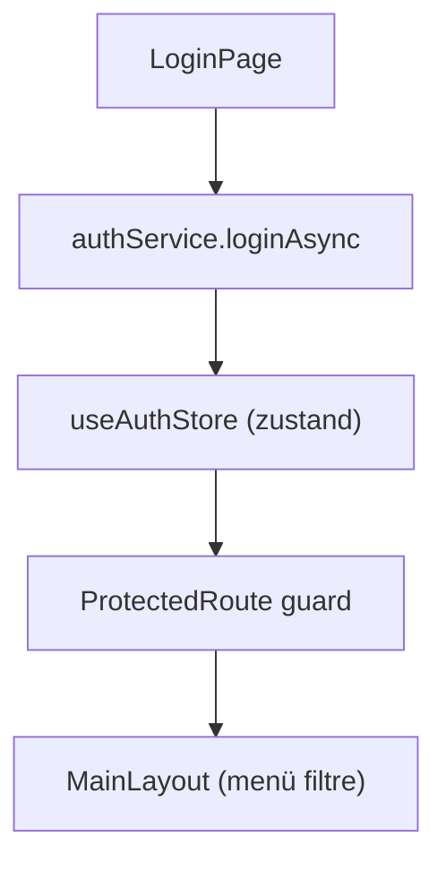
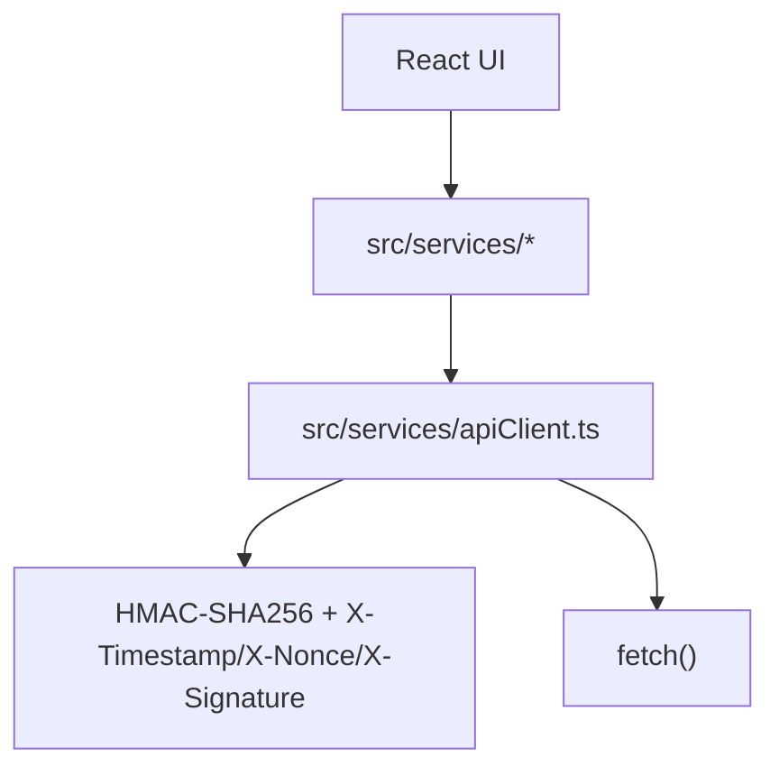
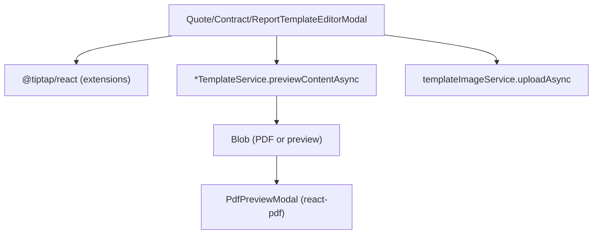

# İskeleTakip Frontend (Electron Renderer) Teknik Özeti

Bu doküman, İskeleTakip uygulamasının frontend tarafında kullanılan teknolojileri ve kritik özellikleri kodla birebir uyumlu şekilde anlatır. Dokümanın amacı; başka bir yapay zekanın projeyi “bağlamı yakalayarak” hızlıca anlamasını sağlamaktır.

## Kısa Genel Bakış

Frontend, `Electron + React + TypeScript` ile çalışan bir masaüstü renderer uygulamasıdır. Uygulama; müşteri, envanter, depo, sözleşme/teklif, çek, stok fişleri ve raporlar üzerinden yönetim ekranları sunar.

Frontende en kritik 3 konu:
1. Kimlik doğrulama + yetki (route guard ve menü filtreleme)
2. API istekleri (central `ApiClient` + request signing + blob akışları)
3. Doküman/şablon üretimi (Tiptap editörleri + PDF önizleme/gösterim)

## Teknoloji Stack

Bu proje frontend tarafında şu teknolojileri kullanır:

* Dil/derleme: `TypeScript`
* Build sistemi: `Vite`
* UI framework: `React`
* Routing: `react-router-dom` (renderer içinde `HashRouter`)
* State/Auth: `zustand` (global `useAuthStore` + `localStorage` persist)
* Styling:
  * `Tailwind CSS` (utility sınıfları + component/class seviyesinde reusable stiller)
  * `src/styles/index.css` içinde Tailwind `@layer components` ile buton/card/badge/input gibi sınıflar tanımlı
* Ikonlar: `@phosphor-icons/react`
* Dashboard görselleştirme: `recharts` (grafik bileşenleri)
* Doküman şablon editörü: `@tiptap/react`
  * StarterKit, Table/TableRow/TableCell/TableHeader, TextAlign, Underline, Image + `tiptap-extension-resize-image`
  * `CustomImage` extension: `image:ImageId` formatını API görsel URL’sine çevirir
* PDF görüntüleme:
  * `react-pdf` (PDF’i renderer içinde `PdfPreviewModal` üzerinden sayfa/sayfa gösterme)
  * Polyfill ihtiyacı: `src/main.tsx` içinde bazı ortam uyumlulukları (URL.parse / Promise.try)

## Katmanlar ve Dosya Haritası

Frontend organizasyon mantığı şu şekilde:

* `src/main.tsx`: renderer giriş noktası, ortam polyfill’leri + `ReactDOM.createRoot`
* `src/App.tsx`: tüm route tanımları (`HashRouter` + sayfalar)
* `src/layouts/MainLayout.tsx`: sidebar ve menü filtreleme (permission bazlı)
* `src/components/`: ortak UI bileşenleri
* `src/components/modals/`: modal ekranlar (detail CRUD, editör, preview, confirm)
* `src/pages/`: sayfa ekranları
* `src/store/`: Zustand store’ları (auth)
* `src/services/`: API client sarmalı + domain servisleri
* `src/models/`: TypeScript domain modelleri / DTO’lar
* `src/utils/`: formatlama/hata mesajı yardımcıları

## Kimlik Doğrulama ve Yetkilendirme (AuthN/AuthZ)

### Akış: Login -> Store -> ProtectedRoute -> Menü filtreleme

1. Kullanıcı `src/pages/LoginPage.tsx` ekranından giriş yapar.
2. `src/services/authService.ts` içinde `POST /auth/login` çağrılır.
3. `src/store/authStore.ts`:
   * token: `localStorage`’a `auth_token` anahtarıyla yazılır
   * kullanıcı: `localStorage`’a `auth_user` olarak JSON saklanır
   * store üzerinden `isAuthenticated` hesaplanır
4. Route bazlı erişim:
   * `src/components/ProtectedRoute.tsx`
   * `isAuthenticated=false` ise `/login`’e yönlendirir
   * `adminOnly=true` ise `isAdminUser(user)` kontrol eder
   * `requiredPermission` verilirse `user.Permissions` içinde arar
5. Sidebar görünürlüğü:
   * `src/layouts/MainLayout.tsx` menü itemlarını permission’a göre filtreler
   * `'/system-settings'` için ayrıca admin kontrolü vardır (`isAdminUser`)

### Admin kontrol mantığı

`src/utils/authHelpers.ts` içindeki `isAdminUser` fonksiyonu birden fazla olası backend payload alanına göre admin belirler (ör: `UserId===1`, `Username==='admin'`, `role==='admin'`, `roleId===1`, `RoleId===1` vb.).

### Not: Auth ile request signing etkileşimi

* `ApiClient` token’ı `useAuthStore.getState().token` üzerinden alır.
* `CustomImage` extension ise token’ı `localStorage`’tan (`auth_token`) okumaya devam eder ve bazı durumlarda görsel URL’sine `?token=...` query ekler.

## Routing

`src/App.tsx` içinde `HashRouter` kullanılır:

* Route’lar örnek olarak:
  * `/` -> Dashboard
  * `/customers` -> Customers
  * `/inventory` -> Inventory
  * `/warehouses` ve `/warehouses/:id` -> Depolar
  * `/contracts` -> Sözleşmeler
  * `/purchase-invoices` -> Alış Faturaları
  * `/stock-receipts` -> Stok fişleri
  * `/checks` -> Çekler
  * `/reports/rental-movement` -> Kiralama Hareket Raporu
  * `/system-settings` -> Sistem ayarları

`*` wildcard ile tanımsız route `/`’a yönlendirilir.

## API İstek Deseni ve Request Signing

### Merkezi istek katmanı: `src/services/apiClient.ts`

Bu dosya tüm HTTP isteklerini tek noktadan yönetir:

* Base URL:
  * `import.meta.env.VITE_API_BASE_URL` yoksa `http://localhost:3000`
* Yetkilendirme:
  * token varsa `Authorization: Bearer <token>` ekler
* Request signing (opsiyonel):
  * `import.meta.env.VITE_SIGNING_ENABLED === 'true'` ise aktiftir
  * `VITE_SIGNING_SECRET` tanımlı değilse signing açıkken hata fırlatılır
  * Web Crypto ile `HMAC-SHA256` üretimi
  * İmza header’ları:
    * `X-Timestamp`
    * `X-Nonce`
    * `X-Signature`
  * İmza dışlanan endpoint’ler:
    * `/health`
    * `/auth/login`
* İstek metotları:
  * `get`, `post`, `patch`, `delete`
* Blob akışları (PDF/Doc üretimi):
  * `getBlob(endpoint)`
  * `postBlob(endpoint, body?)`

### Hata mesajı üretimi

`src/services/apiClient.ts` hata durumunda `responseText` tutar ve `src/utils/apiError.ts`:
* backend’den gelen JSON `message` veya `errors[]` alanlarını ayıklar
* ayıklanamıyorsa ilk satırı veya ham mesajı döndürür

## Zustand Store (Auth State)

`src/store/authStore.ts`:
* `useAuthStore` auth state’i tutar
* `login(token, user)`:
  * `auth_token` + `auth_user` yaz
  * `token`, `user`, `isAuthenticated` set et
* `logout()`:
  * `localStorage` temizle
  * state’i resetle

## Domain Servisleri Envanteri (`src/services/*`)

Bu katmanda her servis, ilgili endpoint grubunu TypeScript signature’larla sarar. Aşağıdaki bilgiler hem endpoint hem de UI’de nasıl kullanıldığını anlamak için “harita” gibi düşünülebilir.

* `src/services/apiClient.ts`
  * `get/post/patch/delete` + `getBlob/postBlob`
  * request signing (HMAC-SHA256) ve signing header’ları
  * hata responseText/parse akışı
* `src/services/authService.ts`
  * `loginAsync(credentials)` -> `POST /auth/login`
* `src/services/permissionService.ts`
  * `getAllAsync()` -> `GET /permissions`
* `src/services/userService.ts`
  * `getAllAsync()` -> `GET /users`
  * `searchAsync(searchText)` -> client-side filtre (server tarafında search yok)
  * `createAsync()` -> `POST /users`
  * `updateAsync()` -> `PATCH /users/:id`
  * `deleteAsync()` -> `DELETE /users/:id`
* `src/services/customerService.ts`
  * `getAllAsync()` -> `GET /customers`
  * `searchAsync()` -> client-side filtre (server search yok)
  * CRUD: `POST /customers`, `PATCH /customers/:id`, `DELETE /customers/:id`
  * `getAuditLogsByCustomerAsync()` -> `GET /customers/:customerId/audit-logs`
* `src/services/siteService.ts`
  * `getByCustomerAsync(customerId)` -> `GET /customers/:customerId/sites`
  * CRUD: `POST/PATCH/DELETE /customers/:customerId/sites` ve `/sites/:siteId`
* `src/services/inventoryService.ts`
  * Categories CRUD: `GET/POST/PATCH/DELETE /categories...`
  * Inventory CRUD: `GET/POST/PATCH/DELETE /inventory...`
  * `getByCategoryAsync(categoryId)` -> API’de by-category yok varsayımıyla tüm envanteri alıp client-side filtre
  * Inventory detay ek uçlar:
    * `getPriceTiersAsync(itemId)` -> `GET /inventory/:itemId/price-tiers`
    * `getSubCategoriesAsync(itemId)` -> `GET /inventory/:itemId/subcategories`
    * `getWarehousesByItemAsync(itemId)` -> `GET /inventory/:itemId/warehouses`
    * `getAuditLogsByItemAsync(itemId)` -> `GET /inventory/:itemId/audit-logs`
* `src/services/subcategoryService.ts`
  * `getAllAsync(categoryId?)` -> `GET /subcategories` (isterse `?categoryId=...`)
  * CRUD: `POST/PATCH/DELETE /subcategories...`
* `src/services/warehouseService.ts`
  * Warehouses CRUD: `GET/POST/PATCH/DELETE /warehouses...`
  * Stock yönetimi:
    * `getStockAsync(warehouseId)` -> `GET /warehouses/:warehouseId/stock`
    * `addOrUpdateStockAsync(warehouseId, data)` -> `POST /warehouses/:warehouseId/stock`
    * `removeStockAsync(warehouseId, itemId)` -> `DELETE /warehouses/:warehouseId/stock/:itemId`
  * `getAuditLogsByWarehouseAsync(warehouseId)` -> `GET /warehouses/:warehouseId/audit-logs`
* `src/services/pricingRulesService.ts`
  * CRUD: `GET/POST/PATCH/DELETE /pricing-rules...`
  * `toggleActiveAsync(id, isActive)` -> `PATCH /pricing-rules/:id` (IsActive)
  * `calculatePriceAsync(contractId, actualEndDate?)` -> `GET /pricing-rules/calculate?...`
* `src/services/priceTierService.ts`
  * `getAllAsync(itemId?)` -> `GET /price-tiers` (isterse `?itemId=...`)
  * CRUD: `GET/POST/PATCH/DELETE /price-tiers...`
  * `getPriceMultiplierForDaysAsync(itemId, days)` -> client-side uygun tier bulur
* `src/services/contractService.ts`
  * Liste/filtre:
    * `getAllAsync()` -> `GET /contracts`
    * `getActiveContractsAsync()` -> `GET /contracts?status=active`
    * `getCompletedContractsAsync()` -> `GET /contracts?status=completed`
  * Detay/CRUD: `GET /contracts/:id`, `POST /contracts`, `PATCH /contracts/:id`, `DELETE /contracts/:id`
  * Tamamlama: `completeContractAsync(id, actualEndDate)` -> `PATCH /contracts/:id` (ActualEndDate + IsCompleted)
  * İade akışı:
    * `returnItemAsync(contractId, itemId, warehouseId, returnQuantity, options?)` -> `POST /contracts/:contractId/return`
    * `getReturnsAsync(contractId)` -> `GET /contracts/:contractId/returns`
  * Hesaplama:
    * `calculatePriceAsync(contractId)` -> `POST /contracts/:contractId/calculate-price`
  * Doküman akışları:
    * `generateDocumentAsync(contractId, templateId, format)` -> `POST /contracts/:contractId/generate-document` (Blob)
    * `previewDocumentAsync(contractId, templateId)` -> `POST /contracts/:contractId/preview-document` (Blob)
  * Audit:
    * `getAuditLogsByContractAsync(contractId)` -> `GET /contracts/:contractId/audit-logs`
* `src/services/quoteService.ts`
  * Liste/filtre:
    * `getAllAsync(status?)` -> `GET /quotes` veya `GET /quotes?status=...`
  * Detay/CRUD: `GET /quotes/:id`, `POST /quotes`, `PATCH /quotes/:id`, `DELETE /quotes/:id`
  * Kabul/Red:
    * `acceptQuoteAsync(id)` -> `PATCH /quotes/:id` (Status='accepted')
    * `rejectQuoteAsync(id)` -> `PATCH /quotes/:id` (Status='rejected')
  * Dönüşüm:
    * `convertToContractAsync(id, options?)` -> `POST /quotes/:id/convert` (defaultWarehouseId veya warehouseAssignments)
  * Doküman akışları:
    * `generateDocumentAsync(quoteId, templateId, format)` -> `POST /quotes/:quoteId/generate-document` (Blob)
    * `previewDocumentAsync(quoteId, templateId)` -> `POST /quotes/:quoteId/preview-document` (Blob)
* `src/services/checkService.ts`
  * `getAllAsync(filters)` -> `/checks` + querystring
  * Detay/CRUD: `GET /checks/:id`, `POST /checks`, `PATCH /checks/:id`, `DELETE /checks/:id`
  * PDF indir:
    * `downloadPdfAsync(id)` -> `GET /checks/:id/pdf` (Blob)
* `src/services/stockReceiptService.ts`
  * Liste: `getAllAsync(params?)` -> `/stock-receipts` + querystring
  * Detay: `getByIdAsync(id)` -> `GET /stock-receipts/:id`
  * Create: `POST /stock-receipts`
  * Cancel: `PATCH /stock-receipts/:id/cancel`
  * PDF:
    * `getPdfBlobAsync(id, templateId?)` -> `GET /stock-receipts/:id/pdf?templateId=...`
* `src/services/purchaseInvoiceService.ts`
  * CRUD:
    * `GET /purchase-invoices`
    * `GET /purchase-invoices/:id`
    * `POST /purchase-invoices`
    * `PATCH /purchase-invoices/:id`
    * `DELETE /purchase-invoices/:id`
  * `searchAsync(searchText)` -> server search endpoint’i yok varsayımıyla client-side filtre
* `src/services/reportService.ts`
  * Rapor data:
    * Customer report: `/reports/customer/:customerId` (opsiyonel dateFrom/dateTo)
    * Site report: `/reports/site/:siteId`
    * Global inventory report: `/reports/inventory/global`
  * PDF:
    * `.../pdf` varyantları ve optional `templateId`
* `src/services/quoteTemplateService.ts`, `src/services/contractTemplateService.ts`, `src/services/reportTemplateService.ts`
  * Template CRUD:
    * `/quote-templates...`, `/contract-templates...`, `/report-templates...`
    * `getDefaultAsync()` -> `/.../default`
    * `copyAsync(...)` -> `POST /.../:id/copy`
  * Önizleme:
    * `previewAsync(id)` -> `POST /.../:id/preview` (Blob)
    * `previewContentAsync(content)` -> `POST /.../preview-content` (Blob)
* `src/services/templateImageService.ts`
  * Template-image CRUD:
    * `getAllAsync()` -> `GET /template-images`
    * `getByIdAsync(id)` -> `GET /template-images/:id` (Blob)
    * `getMetaAsync(id)` -> `GET /template-images/:id/meta`
    * `deleteAsync(id)` -> `DELETE /template-images/:id`
  * Upload:
    * `uploadAsync(file)`:
      * max 5MB
      * sadece `image/jpeg,image/png,image/gif,image/webp`
      * dosyayı `FileReader` ile base64’e çevirir ve `POST /template-images`
* `src/services/adminService.ts`
  * `downloadSystemBackupAsync()` -> `POST /api/v1/admin/system/backup` (Blob)
* `src/services/auditLogService.ts`
  * `getAuditLogsAsync(params)` -> `GET /audit-logs` (limit, userId(s), tableName(s), action, dateFrom/dateTo, recordId)

## Kritik UI Özellikleri ve Akışlar

### Dashboard

`src/pages/DashboardPage.tsx`

* Birden fazla service’i paralel çağırır:
  * `contractService.getAllAsync()`
  * `customerService.getAllAsync()`
  * `inventoryService.getAllAsync()`
* KPI hesaplar:
  * aktif/tamamlanan sözleşme sayıları
  * toplam müşteri sayısı
  * kirada olan envanter (inventory.OnRent toplamı)
  * gelir (completed contract FinalCalculatedPrice toplamı)
  * son 6 ay gelir dağılımı
  * planlanan bitiş tarihlerine göre uyarı (overdue/critical/warning)
* Görselleştirme:
  * `recharts` (ör: bar chart/axis/tooltip)
  * ek olarak proje içi dağılım bar mantığı için `DistributionBar` benzeri yardımcılar bulunur

### ItemPickerPanel ve SearchableItemCombobox (Türkçe odaklı arama)

`src/components/ItemPickerPanel.tsx`

* Kategori ağacı + alt kategori mantığı (expandedCategoryIds)
* Türkçe harf bazlı hızlı filtre:
  * alfabe dizisi `TURKISH_LETTERS`
  * ürün adının ilk karakteri Türkçe büyük harfe çevrilerek gruplandırılır
  * sayı başlangıcı için `'0'`, harf olmayanlar için `'#'` kullanılır
* Arama:
  * `toLocaleLowerCase('tr-TR')` ile Türkçe uyumlu sorgu
  * ad/kod/kategori adlarında includes araması

`src/components/SearchableItemCombobox.tsx`

* Combobox davranışı:
  * Aç/Kapat state’i (`isOpen`)
  * `highlightedIndex` ile klavye gezinimi (ArrowUp/ArrowDown/Enter/Escape)
  * listbox’a scrollIntoView ile görünür öğe takibi
* Seçim:
  * seçim sonrası `onChange(itemId)` tetikler
  * arama text’i sıfırlar ve popup kapanır

### Audit timeline bileşeni

`src/components/AuditLogTimeline.tsx`

* `logs` boş/ loading durumlarını ayrı ele alır
* `formatDateTime` ve `buildAuditLogSummary` ile görsel timeline üretir
* `AuditAction` -> etiket rengi dönüşümü yapar

## PDF Önizleme ve Doküman Üretimi

### PDF görüntüleme: `PdfPreviewModal`

`src/components/modals/PdfPreviewModal.tsx`

* `react-pdf` (`Document` + `Page`) kullanır
* `createPortal(..., document.body)` ile overlay’ı body üzerinde render eder
* `useEffect` içinde object URL revoke etme mantığı vardır
* `handleDownload()` ile indir butonu sağlanır

### Doküman üretim/önizleme servisleri

* Sözleşme: `contractService.generateDocumentAsync`, `contractService.previewDocumentAsync`
* Teklif: `quoteService.generateDocumentAsync`, `quoteService.previewDocumentAsync`
* Rapor (global/customer/site): `reportService.get*ReportPdfAsync`
* Stok fişi PDF: `stockReceiptService.getPdfBlobAsync` (templateId opsiyonlu)
* Çek PDF: `checkService.downloadPdfAsync`

### StockReceipt’da özel bir akış

`src/components/modals/StockReceiptDetailModal.tsx`

* Rapor template listesini çeker (`reportTemplateService.getAllAsync`)
* Template seçimine göre:
  * PDF indirme (`getPdfBlobAsync`)
  * PDF önizleme (`PdfPreviewModal` açma)

## Templating (Tiptap) ve Placeholder Sistemi

Bu uygulamanın “doküman” üretimi; template editörleri üzerinden Tiptap JSON içeriklerinin backend’e gönderilmesi ve backend’den Blob (PDF) olarak alınması mantığına dayanır.

### Tiptap editörleri

Template editör modali tipleri:
* `src/components/modals/QuoteTemplateEditorModal.tsx`
* `src/components/modals/ContractTemplateEditorModal.tsx`
* `src/components/modals/ReportTemplateEditorModal.tsx`

### Ortak editör davranışı

Her editör:
* `useEditor({ extensions, content, editable })` ile editor oluşturur
* Placeholder insert mantığı:
  * `{{key}}` formatında metin ekler
  * quote/contract için farklı placeholder setleri vardır
  * report için örnek placeholder: `{{raporBasligi}}`, `{{hareketTablosu}}` vb.
* PDF preview akışı:
  * editor `getJSON()` alır
  * ilgili `*TemplateService.previewContentAsync(content)` çağrılır
  * dönen Blob:
    * boşsa hata/alert
    * PDF değilse veya küçükse metin parse/uyarı yapılır
    * PDF ise object URL üretilip `PdfPreviewModal` ile gösterilir

### Tiptap Table/Align/Underline kullanımı

Editör extension’ları:
* `StarterKit`
* `Table` + TableRow/TableCell/TableHeader
* `TextAlign` (heading/paragraph tipleri)
* `Underline`
* Contract/Quote editörlerinde resiz​e image: `tiptap-extension-resize-image`

### Görsel yönetimi (template görselleri)

`src/components/modals/CustomImageExtension.ts`

* `image:ImageId` formatında src attribute parse eder
* render aşamasında:
  * API URL oluşturur (`/template-images/<id>`)
  * mümkünse token query param olarak ekler (`?token=...`)
* `allowBase64: true` ve `inline: false` konfigürasyonu vardır

Quote/Contract Template editor’lar:
* Görsel yükleme: `templateImageService.uploadAsync(file)`
* Görselleri listeleme: `templateImageService.getAllAsync()`
* Seçilen görseli editor içine ekleme:
  * `editor.chain().focus().setImage({ src: 'image:ImageId' }).run()`

### Rapor template’de “hareket tablosu” placeholder’ı

`src/components/modals/ReportTemplateEditorModal.tsx`:
* placeholder olarak `{{hareketTablosu}}` enjekte edilir
* preview akışı rapor template servisi üzerinden çalışır

## Modallar: Detay/CRUD/Edit/Preview Envanteri

Aşağıdaki liste, modal dosyalarını isimlerinden ve okunan örneklerinden yola çıkarak “ne işe yaradıklarını” hızlıca kataloglamak için hazırlanmıştır.

* `src/components/modals/PdfPreviewModal.tsx` : Blob PDF’i `react-pdf` ile görüntüler
* `src/components/modals/ConfirmModal.tsx` : Genel “onay/iptal” confirm overlay
* `src/components/modals/ManualLineItemModal.tsx` : Quote/Contract için manuel satır (Description/Quantity/DailyPrice)
* `src/components/modals/ProductPickerModal.tsx` : `ItemPickerPanel` ile ürün seçimi + miktar
* `src/components/SearchableItemCombobox.tsx` : (kombobox bileşen) modallerde arama ihtiyacı için kullanılır
* Detail/Edit modalları:
  * `src/components/modals/ContractDetailModal.tsx` : Sözleşme detayı (iade akışı, fiyat hesaplama, template seçimi, PDF preview, audit timeline)
  * `src/components/modals/QuoteDetailModal.tsx` : Teklif detayı (dönüşüm, satır yönetimi, template seçimi, PDF preview, audit timeline)
  * `src/components/modals/CheckDetailModal.tsx` : Çek detayı (müşteri seçimi, check bilgileri, durum update)
  * `src/components/modals/StockReceiptDetailModal.tsx` : Stok fişi detayı (kalem ekleme, transfer opsiyonlu, template seçimi ile PDF önizleme)
  * `src/components/modals/InventoryDetailModal.tsx` : Malzeme detayı (kategori/subkategori seçimi, depo stoğu girişleri, audit timeline)
  * `src/components/modals/WarehouseDetailModal.tsx` : Depo detayı (stok yönetimi, audit timeline)
  * `src/components/modals/CustomerDetailModal.tsx`, `src/components/modals/CategoryDetailModal.tsx`, `src/components/modals/PricingRuleDetailModal.tsx`, `src/components/modals/PriceTierDetailModal.tsx`, `src/components/modals/UserDetailModal.tsx` : ilgili entity için CRUD + audit timeline desenleri
  * `src/components/modals/ProductPickerModal.tsx` / `src/components/modals/ContractTemplateEditorModal.tsx` / `src/components/modals/QuoteTemplateEditorModal.tsx` / `src/components/modals/ReportTemplateEditorModal.tsx` : template edit/preview
  * `src/components/modals/ContractTemplateEditorModal.tsx`, `src/components/modals/QuoteTemplateEditorModal.tsx` : placeholder + resimli template edit + PDF preview
  * `src/components/modals/ReportTemplateEditorModal.tsx` : placeholder + hareket tablosu + PDF preview

## Modeller (`src/models/index.ts`) – Bağlamı Güçlendiren Veri Sözleşmeleri

Frontend; REST API’den gelen verileri `src/models/index.ts` içindeki TypeScript tipleri ile şekillendirir. En önemli bölümler:

* Ana domain entity’leri:
  * `Customer`, `ConstructionSite`
  * `MaterialCategory`, `SubCategory`
  * `Inventory` (stok + fiyatlar + kategoriler/sub kategoriler)
  * `Contract` + `ContractDetail` (sözleşme + kalem detayları)
  * `Quote` + `QuoteDetail` (teklif + kalem detayları) ve `QuoteLineItem` (inventory/manual ayrımı)
  * `Check` (çek)
  * `Warehouse` + `WarehouseStock`
  * `StockReceipt` + `StockReceiptDetail` + `StockReceiptItem`
  * `PricingRule`, `PriceTier`
* Audit ve raporlama:
  * `AuditLog`, `AuditAction`
  * Rental Movement raporları:
    * `RentalMovementReportResponse` ve related `RentalMovementSummary*`
    * (bu modellerde rapor alanları `snake_case` görünebilir; ör: `product_id`, `customer_name`)
* Template ve template görselleri:
  * `ContractTemplate`, `QuoteTemplate`, `ReportTemplate`
  * `TemplateImage` ve `ImageUsageStats`
  * Template içerikleri `Content: any` olarak Tiptap JSON formatında saklanır/iletilir

## Ortam/Polyfill Notları

`src/main.tsx` içinde:
* bazı pdf.js ortamlarında `URL.parse` yok varsayımı için polyfill
* `Promise.try` benzeri bir polyfill
* `URL.canParse` kontrolü için yardımcı tanım

Bu, Electron/Chromium sürüm farklarında `react-pdf` çalışması için eklenmiş güvenlik önlemi olarak düşünülebilir.

## Mermaid: Ana Veri/Akış Haritaları

### AuthN/AuthZ + Routing

### API Client + Request Signing

### Tiptap Template Editor + Preview

