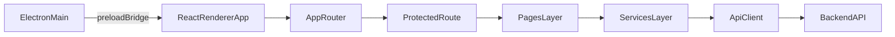
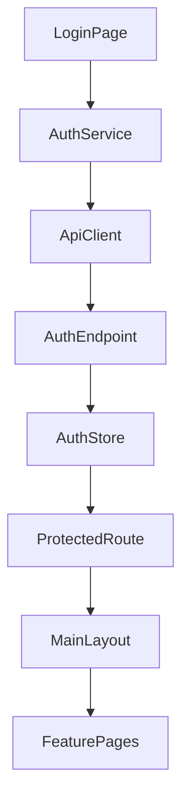

# Frontend/Electron Teknik Dokümantasyon

## 1) Doküman Amacı ve Kapsam

Bu doküman, `IskeleTakipElectron` projesinin frontend (React renderer) ve Electron entegrasyon katmanının teknik mimarisini, kullanılan teknolojileri ve operasyonel davranışlarını tek bir referansta toplar.

- Kapsam dahili: Electron `main/preload`, React uygulaması, routing, auth, state, servis katmanı, build/paketleme, UI altyapısı.
- Kapsam harici: Backend servis implementasyon detayları, veritabanı şeması, CI/CD altyapısı.

---

## 2) Yüksek Seviye Mimari

Uygulama Electron içinde çalışan bir React SPA'dır. Electron ana süreç pencereleri ve güvenlik politikasını yönetir; React renderer iş mantığı, ekranlar ve API iletişimini üstlenir.

### 2.1 Electron Katmanı

- Ana süreç girişi `electron/main.ts` dosyasıdır.
- Pencere oluşturma, preload tanımı, dev/prod yükleme davranışı ve CSP başlıkları burada tanımlanır.
- `nodeIntegration: false` ve `contextIsolation: true` ayarlarıyla renderer tarafı izole edilir.

Referanslar:
- `electron/main.ts`
- `electron/preload.ts`

### 2.2 Preload Köprüsü

- `electron/preload.ts`, `contextBridge.exposeInMainWorld` ile yalnızca sınırlı API yayımlar.
- Mevcut durumda renderer'a `electron.platform` değeri aktarılır.
- Bu yaklaşım IPC yüzeyini minimal tutarak saldırı alanını daraltır.

Referans:
- `electron/preload.ts`

### 2.3 React Renderer Katmanı

- Uygulama girişi `src/main.tsx` dosyasındadır.
- Global stil dosyası (`src/styles/index.css`) burada yüklenir.
- `react-pdf/pdf.js` uyumluluğu için `URL.parse`, `URL.canParse` ve `Promise.try` polyfill'leri uygulanır.

Referans:
- `src/main.tsx`

---

## 3) Uygulama Başlangıç ve Çalışma Akışı

1. Electron uygulaması açılır ve `BrowserWindow` oluşturulur.
2. Development modunda `http://localhost:5175`, production modunda `dist-web/index.html` yüklenir.
3. Renderer içinde `App` bileşeni mount edilir.
4. `HashRouter` route çözümlemesi yapar.
5. `ProtectedRoute`, oturum/yetki kontrolleri sonrası sayfaları render eder.

Referanslar:
- `electron/main.ts`
- `src/main.tsx`
- `src/App.tsx`
- `src/components/ProtectedRoute.tsx`

---

## 4) Routing ve Erişim Kontrolü

### 4.1 Router Yapısı

- Router tipi: `HashRouter` (Electron paketli dağıtımla uyumlu).
- Kimlik doğrulama gerektiren route'lar `ProtectedRoute` ile sarılır.
- Örnek route kümeleri:
  - Operasyon: `customers`, `inventory`, `contracts`, `stock-receipts`, `cash`
  - Raporlama: `reports/rental-movement`
  - Yönetim: `users`, `audit-logs`, `system-settings`

Referans:
- `src/App.tsx`

### 4.2 Route Guard Davranışı

`ProtectedRoute` üç seviyede kontrol yapar:

1. **Oturum kontrolü**: `isAuthenticated` false ise `/login` yönlendirmesi.
2. **Admin-only kontrolü**: `adminOnly` route'larda `isAdminUser(user)` ile doğrulama.
3. **Permission kontrolü**: `requiredPermission` varsa `user.permissions` içinde aranır.

Referanslar:
- `src/components/ProtectedRoute.tsx`
- `src/utils/authHelpers.ts`

---

## 5) Kimlik Doğrulama ve Oturum Yönetimi

Login ve oturum yaşam döngüsü Zustand tabanlı auth store etrafında kuruludur.

### 5.1 Auth Store

- `src/store/authStore.ts` içinde `token`, `user`, `isAuthenticated` tutulur.
- `login()` çağrısı token ve kullanıcıyı `localStorage`'a (`auth_token`, `auth_user`) yazar.
- `logout()` çağrısı store ve localStorage temizliği yapar.
- Başlangıçta persist edilmiş veri okunur; eski/uyumsuz kullanıcı formatı algılanırsa temizlenir.

### 5.2 Admin Tespiti

`isAdminUser()` fonksiyonu birden çok fallback kullanır:
- `userId === 1`
- `username === 'admin'`
- `role === 'admin'`
- `roleId === 1`
- `roleName === 'admin'`

Referanslar:
- `src/store/authStore.ts`
- `src/utils/authHelpers.ts`

---

## 6) State Yönetimi Stratejisi

Uygulama global state'i sınırlı ve amaç odaklı tutar:

- **Auth State**: Kullanıcı ve token yaşam döngüsü (`useAuthStore`).
- **Toast State**: Bildirim kuyruğu, otomatik kapanma süreleri, tekrar engelleme (`useToastStore`).

Bu yapı, geniş kapsamlı bir global store yerine domain servis + lokal component state yaklaşımını tercih eder.

Referanslar:
- `src/store/authStore.ts`
- `src/hooks/useToast.ts`
- `src/components/ToastContainer.tsx`

---

## 7) UI Katmanı ve Modül Organizasyonu

### 7.1 Layout ve Navigasyon

- `MainLayout`, sidebar + header + içerik alanından oluşur.
- Menü yapısı üç bölümde yönetilir: Operasyon, Raporlar, Yönetim.
- Menü görünürlüğü hem permission bazlı hem de sistem ayarları için admin bazlı filtrelenir.
- Sidebar durumu ve section açık/kapalı bilgisi localStorage'a persist edilir.

Referans:
- `src/layouts/MainLayout.tsx`

### 7.2 Sayfa ve Modal Deseni

Proje, domain odaklı page + modal kombinasyonu kullanır. Örnekler:

- Müşteri: `CustomersPage` + `CustomerDetailModal`
- Envanter: `InventoryPage` + `InventoryDetailModal` + `CategoryDetailModal`
- Sözleşme/Teklif: `ContractsPage` + `ContractDetailModal` + `QuoteDetailModal`
- Çek: `ChecksPage` + `CheckDetailModal` + `ConfirmModal`
- Nakit: `CashPage`/`CashAccountDetailPage` + işlem/detay modalları

Not: Modal bileşenleri ağırlıklı olarak `src/components/modals` altında toplanır.

### 7.3 Model Katmanı

`src/models/index.ts` merkezi tip sözleşmesi sağlar. Aşağıdaki alanları kapsar:

- CRM/operasyon: müşteri, şantiye, envanter, depo
- Ticari süreç: sözleşme, teklif, fiyat tarifesi, fiyatlandırma kuralı
- Finans: çek, nakit hesap/işlem
- Doküman ve rapor: şablonlar, kiralama hareket raporu
- Yönetim: kullanıcı, izinler, audit log

Referans:
- `src/models/index.ts`

---

## 8) API İstemci Katmanı ve Servis Yapısı

### 8.1 `ApiClient` Sözleşmesi

Tüm HTTP çağrıları `src/services/apiClient.ts` içindeki `ApiClient` sınıfından geçer.

Sağlanan başlıca yetenekler:

- `Authorization: Bearer <token>` header otomasyonu.
- `GET/POST/PATCH/DELETE` JSON istekleri.
- Blob indirme (`getBlob`, `getBlobDownload`).
- Multipart form upload (`postFormData`).
- 204 boş yanıt, parse ve hata normalize etme davranışları.

### 8.2 Request Signing (Opsiyonel)

`VITE_SIGNING_ENABLED=true` ise:
- `X-Timestamp`, `X-Nonce`, `X-Signature` header'ları eklenir.
- İmza, `HMAC-SHA256` ile üretilir.
- `/health` ve `/auth/login` imza dışı bırakılır.

### 8.3 Servis Katmanı Organizasyonu

`src/services/` altında domain bazlı servisler bulunur:

- Auth/izin/yönetim: `authService`, `permissionService`, `userService`, `adminService`, `auditLogService`
- Operasyon: `customerService`, `inventoryService`, `warehouseService`, `contractService`, `quoteService`, `siteService`
- Finans/evrak: `checkService`, `cashService`, `purchaseInvoiceService`, `stockReceiptService`
- Şablon/rapor: `reportService`, `reportTemplateService`, `contractTemplateService`, `quoteTemplateService`, `templateImageService`

Referanslar:
- `src/services/apiClient.ts`
- `src/services/*.ts`

---

## 9) Hata Yönetimi ve Kullanıcıya Yansıtma

### 9.1 API Katmanı Hata Davranışı

- `apiClient`, başarısız HTTP yanıtlarında status ve responseText bilgisini hata objesine ekler.
- JSON parse hatası, boş yanıt ve ağ hataları ayrıştırılır.

### 9.2 Kullanıcı Dostu Mesaj Üretimi

`src/utils/apiError.ts`:
- Backend hata gövdesindeki `message/error/detail/errors[]` alanlarını normalize eder.
- Ağ/401/403/404 gibi yaygın durumlar için kullanıcıya uygun Türkçe mesaj üretir.

### 9.3 Toast Bildirim Altyapısı

- Zustand tabanlı toast kuyruğu (`max 5`).
- Variant bazlı süre (`success/error/warning/info`).
- Kısa aralıkta aynı toast tekrarını engelleme.
- UI render'ı portal ile body üzerinde yapılır.

Referanslar:
- `src/services/apiClient.ts`
- `src/utils/apiError.ts`
- `src/hooks/useToast.ts`
- `src/components/ToastContainer.tsx`

---

## 10) Teknoloji Envanteri

Kaynak: `package.json`

### 10.1 Runtime ve Çatı

- `electron` `^28.0.0`
- `react` `^18.2.0`
- `react-dom` `^18.2.0`
- `typescript` `^5.3.3`
- `vite` `^5.0.8`

### 10.2 UI ve Uygulama Kütüphaneleri

- `react-router-dom` `^6.21.1` (routing)
- `zustand` `^4.4.7` (global state)
- `@phosphor-icons/react` `^2.1.10` (ikonlar)
- `recharts` `^3.7.0` (grafikler)
- `react-pdf` `^7.7.1` + `pdfjs-dist` `^3.11.174` (PDF görüntüleme)

### 10.3 Rich Text / Şablon Editör Altyapısı

- `@tiptap/react`, `@tiptap/starter-kit`, çeşitli `@tiptap/extension-*`
- `tiptap-extension-resize-image`

### 10.4 Build ve Stil Araçları

- `electron-builder` `^24.9.1`
- `@vitejs/plugin-react` `^4.2.1`
- `tailwindcss` `^3.4.0`
- `postcss` `^8.4.32`
- `autoprefixer` `^10.4.16`
- `concurrently`, `wait-on` (dev orkestrasyonu)

### 10.5 Güvenlik Sabitlemeleri

- `overrides.axios = 1.13.2` (paket seviyesinde sabitleme notu mevcut).

Referans:
- `package.json`

---

## 11) Build, Çalıştırma ve Paketleme

### 11.1 NPM Scriptleri

- `npm run electron:dev`: Vite + TS watch + preload kopyalama + Electron başlatma
- `npm run build`: Web build
- `npm run build:electron`: Main/preload/renderer üretimi
- `npm run electron:build`: Electron builder ile installer üretimi
- `npm run electron:pack`: Klasör çıktısı

Referans:
- `package.json`

### 11.2 Vite Konfigürasyonu

- `outDir: dist-web`
- alias: `@ -> ./src`
- `server.port = 5175`, `strictPort = true`
- `base = './'` (paketlenmiş dağıtıma uygun relatif asset yolu)

Referans:
- `vite.config.ts`

### 11.3 Tailwind Konfigürasyonu

- Koyu tema ağırlıklı renk setleri (`background`, `text`, `primary`, vb.)
- Toast giriş/çıkış animasyonları (`toast-in`, `toast-out`)

Referans:
- `tailwind.config.js`

---

## 12) Ortam Değişkenleri ve Konfigürasyon

Temel env değişkenleri:

- `VITE_API_BASE_URL`: API base URL (varsayılan fallback `http://localhost:3000`)
- `VITE_SIGNING_ENABLED`: request signing aktif/pasif
- `VITE_SIGNING_SECRET`: signing anahtarı (enabled ise zorunlu)

Önemli not: `VITE_` ile başlayan değişkenler frontend bundle içine gömülür.

Referanslar:
- `.env.example`
- `src/services/apiClient.ts`
- `README.md`

---

## 13) Tespit Edilen Teknik Riskler ve İyileştirme Önerileri

### Risk 1: Preload dosya adı uyumsuzluğu ihtimali

- `electron/main.ts` preload için `preload.js` beklerken, dev script preload dosyasını `preload.cjs` olarak kopyalıyor.
- Build çıktılarında ad/uzantı uyumu bozulursa preload yüklenmeyebilir.

Öneri:
- Main process preload yolunu derleme çıktısıyla birebir tutarlı hale getirin.
- Build sonrası smoke test (preload bridge erişimi) ekleyin.

### Risk 2: İstemci tarafı signing secret maruziyeti

- `.env.example` dosyasında da not edildiği gibi `VITE_*` değişkenleri bundle'a gömülür.
- Client-side imzalama anahtarı gerçek bir gizli anahtar güvenliği sağlamaz.

Öneri:
- Güvenlik kritik imzalama/doğrulama backend veya Electron main process tarafına taşınmalı.

### Risk 3: Test/Lint otomasyonu görünürlüğü düşük

- Proje scriptlerinde standart `test`/`lint` komutları bulunmuyor.
- Bu durum regresyonları erken yakalamayı zorlaştırır.

Öneri:
- En azından temel lint ve smoke test scriptleri tanımlanmalı.

### Risk 4: Servis katmanında backend uyumluluk fallback maliyeti

- Bazı servislerde endpoint veya alan uyumsuzluklarına tolerans için ek fallback mantıkları var.
- Uzun vadede bakım maliyeti artabilir.

Öneri:
- Backend-frontend sözleşmesi (DTO/endpoint) sürümlenip netleştirilmeli.
- Geçici fallback'ler için kaldırma kriterleri tanımlanmalı.

---

## 14) Operasyonel Notlar

- Uygulama masaüstü kullanımına optimize edilmiş olup route davranışı hash tabanlıdır.
- Permission tabanlı menü görünürlüğü ve route guard birlikte çalışır.
- Üretimde API detay logları baskılanır, geliştirmede ayrıntılı loglama aktiftir.

Referanslar:
- `src/App.tsx`
- `src/layouts/MainLayout.tsx`
- `src/components/ProtectedRoute.tsx`
- `src/services/apiClient.ts`

---

## 15) Dosya Referans Özeti

- Electron: `electron/main.ts`, `electron/preload.ts`
- Uygulama girişi: `src/main.tsx`, `src/App.tsx`
- Güvenlik/Yetki: `src/components/ProtectedRoute.tsx`, `src/utils/authHelpers.ts`
- State: `src/store/authStore.ts`, `src/hooks/useToast.ts`
- API/Servis: `src/services/apiClient.ts`, `src/services/*.ts`
- Modeller: `src/models/index.ts`
- Layout/UI: `src/layouts/MainLayout.tsx`, `src/components/ToastContainer.tsx`
- Build/Config: `package.json`, `vite.config.ts`, `tailwind.config.js`, `.env.example`, `README.md`

